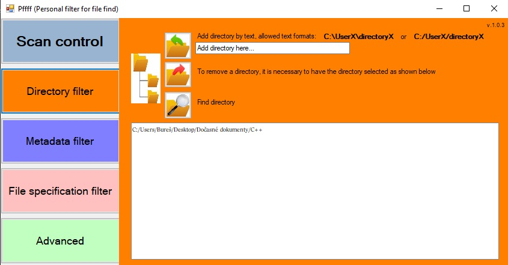

# Pffff (Personal filter for file find)
# .NET Framework (4.7.2, full C++)
## 1) ENG
## 2) ČESKY
## 3) SCREENSHOTS

> ## 1)
PROGRAM DESCRIPTION:
The program Pfff (Personal filter for file find) is a personal solo project for individual use in the field of searching for 
specific .jpg / .JPG files (especially including older types). Its goal is to scan data streams and search for a date type 
specific to .jpg files. Since some older types of .jpg files do not contain EXIF, and similarly, some older EXIF formats are not supported 
for searching on the Windows platform, the program utilizes a complete file scan when necessary. This allows it to locate file creation 
dates even for files that wouldn't be found through regular Windows search methods. As a result, the program is ideal for searching through 
older vacation photos and similar content where finding the creation date using standard Windows search is not feasible. Several "filters" 
are added to the date type to facilitate accurate file retrieval. These filters include:

>"DIRECOTRY FILTER" - for specifying directories to be searched more precisely.

>"METADATA FILTER" - for the option to search only EXIF files or specify a minimum/maximum creation date.

>"FILE SPECIFICATION FILTER" - for specifying minimum file size or the necessity of containing certain text (in the file path or name).

>"ADVANCED" - for further scan settings, as described in the program.

KNOWN LIMITATIONS:
Due to the program's search for a specific date type, it's possible for confusion to occur with other identical date type representations 
(byte streams), although this doesn't apply to, for example, the modification date which has a distinct representation.

ABOUT THE AUTHOR:
bures.peter@email.cz
I am an enthusiastic beginner - junior, who is trying to blend his hobby with a potential future career as a C++ programmer. 
I created this program not only for personal use in finding vacation photos but also as my initial presentation for my dream career 
as a C++ programmer. If you have any questions, feel free to contact me at the email provided above.

> ## 2)
POPIS PROGRAMU:
Program Pfff (Personal filter for file find) je osobním sólo projektem pro osobní použití v oblasti vyhledávání 
konkrétních souborů .jpg / .JPG (hlavně vč. starších typů), který má za cíl prohledávat datový stream a vyhledávat datumový typ 
specifický pro .jpg soubory. Vzhledem k tomu, že některé starší typy .jpg souborů neobsahují EXIF, stejně tak některé staší EXIF formáty
nejsou podporovány pro vyhledávání na platformě Windows, program využívá kompletního scanu souboru - je-li to nutné a tím je schopen vyhledat 
datum vytvoření souboru i u těch souborů, které běžné prohledávání na platformě Windows jinak nenajde. Proto je program ideální na prohledávání 
např. starších fotek z dovolené, apod. u kterého není možné dohledat datum vytvoření běžnou cestou pomocí Windows vyhledávání. 
K datumovému typu je pak dále přidáno několik "filtrů", které usnadňují vyhledání správného souboru. Mezi filtry patří:

> "DIRECOTRY FILTER" - pro přesnější určení adresářů pro vyhledávání

> "METADATA FILTER" - pro možnost vyhledávat pouze EXIF soubory, nebo pro zadání minimálního / maximálního data vytvoření

> "FILE SPECIFICATION FILTER" - pro zadání minimální velikosti souboru nebo nutnosti obsahovat určitý text (v cestě souboru nebo názvu)

> "ADVANCED" - upřesňující nastavení skenování, viz. popis v programu

ZNÁMÉ NEDOSTATKY:
Vzhledem k tomu, že program vyhledává konkrétní datumový typ, je možné, že dojde k zaměnění s jíným zápisem (byte stream) s naprosto shodným 
datumovým typem, (to se netýká např. data změny, který má jiný zápis).

O AUTOROVI:
bures.peter@email.cz
Jsem zapáleným začátečníkem - juniorem, který se snaží spojit svůj koníček s případnou budoucí kariérou C++ programátora.
Tento program jsem vytvořil nejen pro osobní užití k vyhledání fotek z dovolené, ale také jako svou první prezentaci pro vysněnou 
kariéru C++ programátora. V případě jakýchkoli dotazů mě neváhejte kontaktovat na emailu uvedeném výše.

> ## 3)

